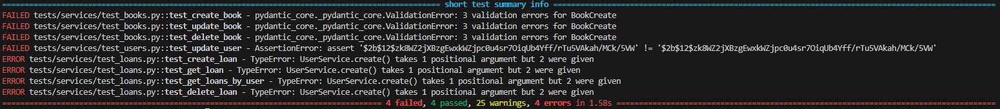

# 📚 Gestion de Bibliothèque – FastAPI TP1
Ce projet est une application de gestion de bibliothèque universitaire basée sur **FastAPI**, structurée selon une architecture **N-Tiers**. Elle expose une API RESTful organisée pour gérer les livres, les utilisateurs et les emprunts.
  
## Exercice 1 : Définition des schémas Pydantic  

Les **schémas Pydantic** servent à valider et structurer les données entrantes et sortantes de l'API. Ils assurent que les données respectent des contraintes de type, longueur, format...  
Chaque entité (Book, User, Loan, Token) possède un fichier dédié dans **src/api/schemas/**  

### 📖 Schémas liés aux livres - src/api/schemas/books.py   

**`BookBase` :**  ce schéma définit les champs de base d’un livre : title, author, isbn, publication_year, description, quantity (type, longueur min/max, description, obligatoire/optionnel). Il est utilisé comme base pour les autres schémas livres.

**`BookCreate` :** ce schéma hérite de BookBase, on l'utilise pour la création d’un livre :   
```python
# Exemple : BookCreate
class BookCreate(BaseModel):
    title: str
    author: str
    isbn: str
    publication_year: int
    quantity: int
```  

Il peut recevoir un objet JSON comme celui-ci depuis le frontend :

```json
{
  "title": "1984",
  "author": "George Orwell",
  "isbn": "9780451524935",
  "quantity": 3
}
```

**`BookUpdate` :** ce schéma contient les mêmes champs que BookBase, mais tous sont optionnels. On l'utilise pour mettre à jour un livre partiellement - PATCH (ex: si on n'a qu'un seul champs à mettre à jour on n'a pas besoin de resaisir toutes les informations).  

**`BookInDBBase` :** ce schéma hérite de BookBase et ajoute les champs id, created_at, updated_at. Il sert de base aux objets renvoyés par l'API.   

**`Book` :** ce schéma est un alias de BookInDBBase, il est utilisé dans les réponses API.

---
### 🧑🏼‍🎓 Schémas liés aux utilisateurs - src/api/schemas/users.py 

**`UserBase` :** ce schéma définit les champs de base d’un utilisateur : email, full_name, is_active, is_admin (type, longueur min/max, description, obligatoire/optionnel). Il est utilisé comme base pour les autres schémas utilisateurs.  

**`UserCreate` :** ce schéma hérite de UserBase et ajoute un champ password, on l'utilise pour la création d’un compte utilisateur.  
```python
# Exemple : UserCreate
class UserCreate(BaseModel):
    email: EmailStr
    full_name: str
    password: str
```  
Exemple JSON :  

```json
{
  "username": "johndoe",
  "email": "johndoe@example.com",
  "password": "Password123"
}
``` 

**`UserUpdate` :** ce schéma contient les mêmes champs que UserCreate, mais tous sont optionnels. On l'utilise pour mettre à jour un utilisateur partiellement.  

**`UserInDBBase` :**	ce schéma hérite de UserBase et ajoute les champs id, created_at, updated_at. Il est utilisé comme base pour les réponses API.  

**`User` :**	ce schéma est un alias de UserInDBBase, il est utilisé dans les réponses API.  

**`UserWithPassword` :**	ce schéma est une variante de UserInDBBase qui inclut un hashed_password. On l'utilise pour la gestion de l’authentification.  

---
### 📆 Schémas liés aux emprunts  - src/api/schemas/loans.py

**`LoanBase` :**	ce schéma définit les champs de bases d'un emprunt : user_id, book_id, loan_date, due_date, return_date (type, longueur min/max, description, obligatoire/optionnel). Il est utilisé comme base pour les autres schémas emprunts.   

**`LoanCreate` :** ce schéma hérite de LoanBase, on l'utilise pour la création d'un nouvel emprunt.  
```python
# Exemple : LoanCreate
class LoanCreate(BaseModel):
    user_id: int
    book_id: int
    due_date: date
```  
Exemple JSON : 

```json
{
  "user_id": 1,
  "book_id": 42,
  "due_date": "2025-06-15"
}
```

**`LoanUpdate` :** ce schéma est utilisé pour mettre à jour la date de retour du livre ou la date d’échéance de l'emprunt.  

**`LoanInDBBase` :**	ce schéma hérite de LoanBase et ajoute les champs id, created_at, updated_at. Il est utilisé comme base pour les réponses API.    

**`Loan` :**	ce schéma est un alias de LoanInDBBase, il est utilisé dans les réponses API.  

---
### 🔐 Schémas pour l’authentification - src/api/schemas/token.py
  
**`Token` :**	ce schéma contient le access_token (JWT) et son type (bearer).  

**`TokenPayload` :**	ce schéma représente les données contenues dans le token JWT : identifiant de l’utilisateur (sub).  

---
### 🔃 Importation des schémas - src/api/schemas/__init__.py   

Ce fichier permet de faciliter les imports dans les autres modules du projet, comme les routes :  
``` python
from .books import Book, BookCreate, BookUpdate
from .users import User, UserCreate, UserUpdate
from .loans import Loan, LoanCreate, LoanUpdate
from .token import Token, TokenPayload
```
---
### Conclusion  

Ce système permet de garantir la cohérence des données échangées entre le client, la base de données et les routes FastAPI.  

## Exercice 2 : Implémentation des routes API  

Cet exercice consiste à créer les routes HTTP REST permettant d’interagir avec les entités principales (books, users, loans, authentification) via l’API. Chaque entité possède son fichier de routes dans **src/api/routes/**  

### 📚 Routes pour les livres - src/api/routes/books.py  

Fonctionnalités :
- Récupérer la liste des livres (GET)
- Créer un nouveau livre (POST)
- Récupérer un livre par son ID (GET)
- Mettre à jour un livre (PUT)
- Supprimer un livre (DELETE)  
  
Exemple pour créer un nouveau livre :    
```python
@router.post("/", response_model=Book, status_code=status.HTTP_201_CREATED)
def create_book(
    *,
    db: Session = Depends(get_db),
    book_in: BookCreate
) -> Any:
    repository = BookRepository(BookModel, db)
    book = repository.create(obj_in=book_in)
    return book
```
---
### 👥 Routes pour les utilisateurs - src/api/routes/users.py  

Fonctionnalités : 
- Récupérer la liste des utilisateurs (GET)
- Créer un nouvel utilisateur (POST)
- Récupérer un utilisateur par son ID (GET)
- Mettre à jour un utilisateur (PUT)
- Supprimer un utilisateur (DELETE)  
  
Exemple pour créer un nouvel utilisateur avec vérification d’e-mail existant et hashage du mot de passe :  
```python
@router.post("/", response_model=User)
def create_user(user_in: UserCreate, db: Session = Depends(get_db)):
    repository = UserRepository(UserModel, db)
    if repository.get_by_email(email=user_in.email):
        raise HTTPException(status_code=400, detail="Email déjà utilisé")
    
    hashed_password = get_password_hash(user_in.password)
    user_data = user_in.dict()
    user_data["hashed_password"] = hashed_password
    del user_data["password"]
    return repository.create(obj_in=user_data)
```  
---
### 📆 Routes pour les emprunts - src/api/routes/loans.py  

Fonctionnalités :  
- Récupérer la liste des emprunts (GET)
- Créer un nouvel emprunt (POST)
- Récupérer un emprunt par son ID (GET)
- Mettre à jour un emprunt (PUT)
- Supprimer un emprunt (DELETE)  

```python
@router.post("/", response_model=Loan, status_code=status.HTTP_201_CREATED)
def create_loan(*, db: Session = Depends(get_db), loan_in: LoanCreate) -> Any:
    user = UserRepository(UserModel, db).get(id=loan_in.user_id)
    book = BookRepository(BookModel, db).get(id=loan_in.book_id)

    if not user:
        raise HTTPException(404, "Utilisateur non trouvé")
    if not book or book.quantity <= 0:
        raise HTTPException(400, "Livre non disponible")

    if not loan_in.due_date:
        loan_data = loan_in.dict()
        loan_data["due_date"] = datetime.utcnow() + timedelta(days=14)
    else:
        loan_data = loan_in.dict()

    loan = LoanRepository(LoanModel, db).create(obj_in=loan_data)

    # Mise à jour du stock
    book.quantity -= 1
    BookRepository(BookModel, db).update(db_obj=book, obj_in={"quantity": book.quantity})

    return loan
```
---
### 🔐 Routes pour l'authentification - src/api/routes/auth.py  

Connexion via email + mot de passe, renvoie un token JWT utilisable pour les routes protégées :

```python
# Route `/auth/login`
@router.post("/login", response_model=Token)
def login_access_token(form_data: OAuth2PasswordRequestForm, db: Session = Depends(get_db)):
    user = repository.get_by_email(email=form_data.username)
    if not user or not verify_password(form_data.password, user.hashed_password):
        raise HTTPException(status_code=401, detail="Invalid credentials")
    
    token = create_access_token(subject=user.id)
    return { "access_token": token, "token_type": "bearer" }
```  
Exemple de réponse :

```json
{
  "access_token": "eyJhbGciOiJIUzI1...",
  "token_type": "bearer"
}
```  
---
### Pour regrouper toutes les routes - src/api/routes/__init__.py   

Les routes sont regroupées par fonctionnalité dans des fichiers séparés puis incluses dans un routeur principal :

```python
# routes/__init__.py
api_router = APIRouter()
api_router.include_router(books_router, prefix="/books", tags=["books"])
api_router.include_router(users_router, prefix="/users", tags=["users"])
api_router.include_router(auth_router, prefix="/auth", tags=["auth"])
```  

Puis dans `main.py` :

```python
app.include_router(api_router, prefix="/api/v1")
```  

Exemples d’URL disponibles :
- `/api/v1/books/`
- `/api/v1/users/`
- `/api/v1/auth/login`

___
# 📚 Gestion de Bibliothèque – FastAPI TP3


## 🔒 Exercice 7 : Mise à jour de la route d’authentification

### 📁 Fichier : `src/api/routes/auth.py`

Nous mettons en place un système d’authentification avec `OAuth2PasswordRequestForm`, en utilisant la couche métier `UserService`.

### 🧹 Code :

```python
@router.post("/login", response_model=Token)
def login_access_token(
    db: Session = Depends(get_db),
    form_data: OAuth2PasswordRequestForm = Depends()
):
    repository = UserRepository(UserModel, db)
    service = UserService(repository)

    user = service.authenticate(email=form_data.username, password=form_data.password)
    if not user:
        raise HTTPException(
            status_code=status.HTTP_401_UNAUTHORIZED,
            detail="Email ou mot de passe incorrect",
            headers={"WWW-Authenticate": "Bearer"},
        )

    if not service.is_active(user=user):
        raise HTTPException(
            status_code=status.HTTP_401_UNAUTHORIZED,
            detail="Utilisateur inactif",
            headers={"WWW-Authenticate": "Bearer"},
        )

    access_token_expires = timedelta(minutes=settings.ACCESS_TOKEN_EXPIRE_MINUTES)
    return {
        "access_token": create_access_token(
            subject=user.id, expires_delta=access_token_expires
        ),
        "token_type": "bearer",
    }
```

---

## 🧪 Exercice 8 : Tests unitaires – Couche métier utilisateur

### 📁 Fichier : `tests/conftest.py`

Mise en place d’une base SQLite en mémoire pour les tests automatisés :

```python
@pytest.fixture(scope="session")
def engine():
    engine = create_engine(
        "sqlite:///:memory:",
        connect_args={"check_same_thread": False},
        poolclass=StaticPool,
    )
    Base.metadata.create_all(engine)
    return engine
```

Client de test FastAPI :

```python
@pytest.fixture(scope="function")
def client(db_session):
    def override_get_db():
        yield db_session

    app.dependency_overrides[get_db] = override_get_db

    from fastapi.testclient import TestClient
    with TestClient(app) as client:
        yield client
    app.dependency_overrides = {}
```

### 📁 Fichier : `tests/services/test_users.py`

#### ✅ Exemple de test : création d’un utilisateur

```python
def test_create_user(db_session: Session):
    repository = UserRepository(User, db_session)
    service = UserService(repository)

    user_in = UserCreate(
        email="test@example.com",
        password="password123",
        full_name="Test User"
    )

    user = service.create(obj_in=user_in)

    assert user.email == "test@example.com"
    assert hasattr(user, "hashed_password")
    assert user.hashed_password != "password123"
```

#### 🔐 Exemple : authentification

```python
def test_authenticate_user(db_session: Session):
    user_in = UserCreate(
        email="auth@example.com",
        password="password123",
        full_name="Auth User"
    )

    user = service.create(obj_in=user_in)
    authenticated_user = service.authenticate(email="auth@example.com", password="password123")

    assert authenticated_user.id == user.id
```

#### 🔄 Exemple : mise à jour

```python
def test_update_user(db_session: Session):
    user = service.create(obj_in=UserCreate(...))
    update = UserUpdate(full_name="New Name")

    updated_user = service.update(db_obj=user, obj_in=update)

    assert updated_user.full_name == "New Name"
```

---

## 📊 Exercice 9 : Service de Statistiques

### 📁 Fichier : `src/services/stats.py`

Un service pour calculer des statistiques globales et détaillées sur les livres, utilisateurs et emprunts.

#### 📈 Statistiques générales

```python
def get_general_stats(self) -> Dict[str, Any]:
    return {
        "total_books": self.db.query(func.sum(Book.quantity)).scalar() or 0,
        "unique_books": self.db.query(func.count(Book.id)).scalar() or 0,
        ...
    }
```

#### 📚 Livres les plus empruntés

```python
def get_most_borrowed_books(self, limit: int = 10) -> List[Dict[str, Any]]:
    result = self.db.query(
        Book.id, Book.title, func.count(Loan.id).label("loan_count")
    ).join(Loan).group_by(Book.id).order_by(func.count(Loan.id).desc()).limit(limit).all()

    return [{"id": book.id, "title": book.title, "loan_count": book.loan_count} for book in result]
```

#### 👥 Utilisateurs les plus actifs

```python
def get_most_active_users(self, limit: int = 10) -> List[Dict[str, Any]]:
    ...
```

---

## 📊 Routes API pour les statistiques

### 📁 Fichier : `src/api/routes/stats.py`

```python
@router.get("/general", response_model=Dict[str, Any])
def get_general_stats(...):
    return StatsService(db).get_general_stats()
```

### 📁 Ajout au routeur principal : `src/api/routes/__init__.py`

```python
api_router.include_router(stats_router, prefix="/stats", tags=["stats"])
```
---

## 🚀 Lancer les tests

Utilisez `pytest` pour lancer les tests :

```bash
pytest
```

---

## 📸 Est-ce que ça marche ?



Non, pas encore.